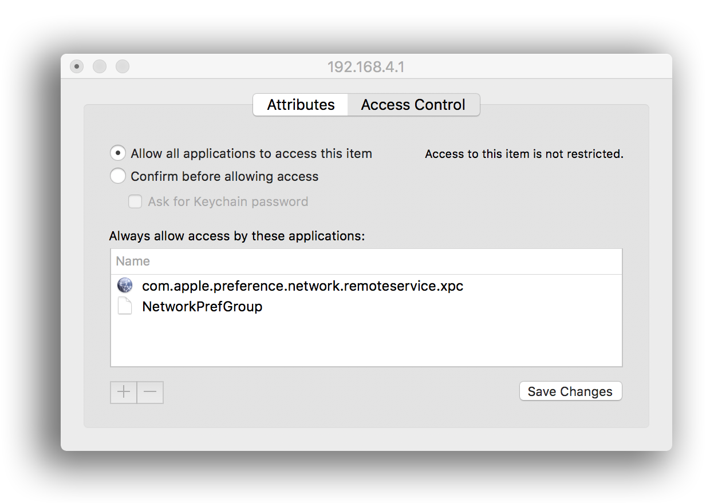

### Procedures
* Open the `Keychain Access` program, select the entry `Login` in the list of keychains.

* Select your proxy server record for the appropriate HTTP or HTTPS protocol. These two records are generated in your account when setting up the Ethernet network interface.

* Open the properties of the entry and go to the `Access` page from the `Attributes` page.
Here, choose one of the options for granting access. You can select `Allow all programs to access this object`, if there is no need to restrict any applications.
