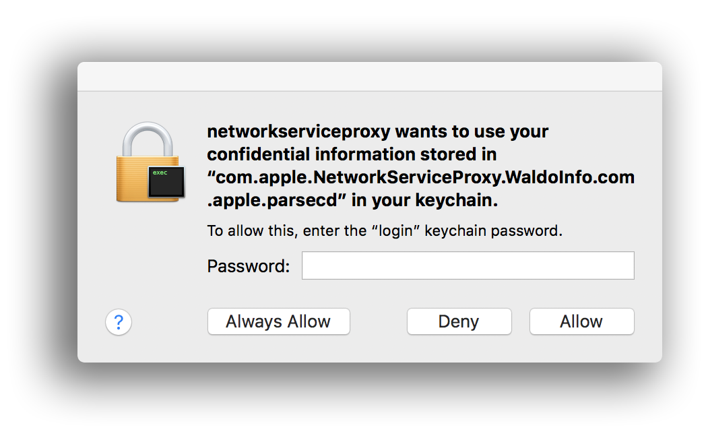

  

---

# RATIONALE #

* This repository collect (a kind of quick list) all the settings and processes running and executing diverse functions inside the MacOSX environment with a focus in security and avoiding leaking, breaching personal data through our proxy server.
* This repo is a living document that will grow and adapt over time

### What is this repository for? ###

* Quick summary
    - Blacklisting/whitelisting HTTP/HTTPS requests across proxy server(s)

### How do I get set up? ###

* Summary of set up
    - a personal computer running MacOSX operating system. That's includes a [hackintosh](https://en.wikipedia.org/wiki/Hackintosh) too!
* Configuration
    - [macOSX operating system](https://en.wikipedia.org/wiki/Macintosh_operating_systems)
	- [LuLu](https://objective-see.com/products/lulu.html): open-source firewall for macOS
	- [Hands Off!](https://www.oneperiodic.com/products/handsoff/): pay-ware firewall for macOS
	- [LittleSnitch](https://www.obdev.at/products/littlesnitch/index.html): pay-ware firewall for macOS
	- or for a detailed method/instructions _vide_ [`colophon.md`](colophon.md)
* Dependencies
    - There is no NPM, Gulp or Brew implied
* How to run tests
    - See [`procedure.md`](Procedure.md)
* Deployment instructions
    - Follow the [instructions](Procedure.md) from every firewall to accept/deny connections

### Who do I talk to? ###

* Repo owner or admin
    - Contact `imhicihu` at `gmail` dot `com`

### Code of Conduct

* Please, check our [Code of Conduct](code_of_conduct.md)

### Legal ###

* All trademarks are the property of their respective owners.

### License ###

* The content of this project itself is licensed under the  
